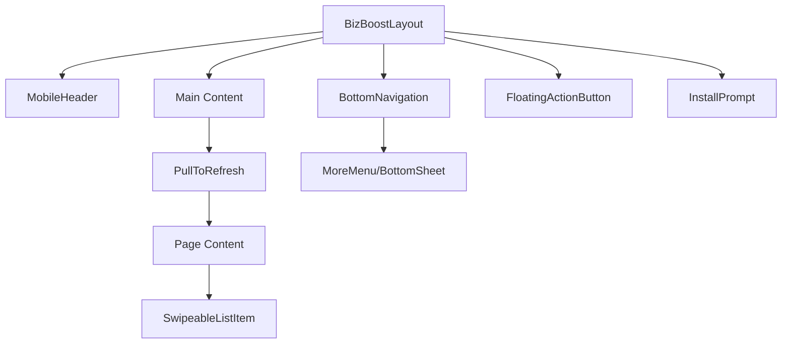
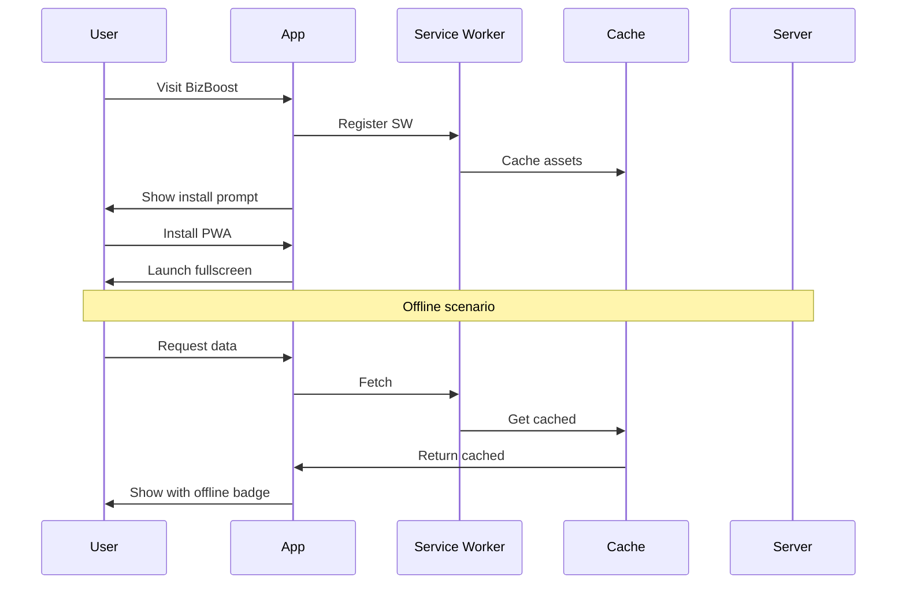

# Design Document

## Overview

This design document outlines the technical implementation for enhancing the BizBoost module's mobile experience within the MyGrowNet platform. The implementation focuses on mobile-first UI components and gesture-based interactions while leveraging the existing MyGrowNet PWA infrastructure.

**Key Architectural Principle:** BizBoost is a module within MyGrowNet, not a standalone app. All PWA functionality (service worker, manifest, caching) is handled by the parent MyGrowNet platform. This spec focuses on mobile UI/UX enhancements specific to the BizBoost module.

## Architecture

### Component Structure

```
resources/js/
├── Components/BizBoost/
│   ├── Mobile/
│   │   ├── BottomNavigation.vue      # Fixed bottom tab bar (BizBoost-specific)
│   │   ├── BottomSheet.vue           # Slide-up modal sheets
│   │   ├── PullToRefresh.vue         # Pull-to-refresh wrapper
│   │   ├── SwipeableListItem.vue     # Swipeable list items
│   │   ├── FloatingActionButton.vue  # FAB component
│   │   ├── MobileHeader.vue          # Native-style header with back button
│   │   └── MoreMenu.vue              # Slide-up more menu
│   └── ...existing components
├── composables/
│   ├── useMobileDetect.ts            # Mobile detection & viewport (shared)
│   ├── useHaptics.ts                 # Haptic feedback API (shared)
│   ├── usePullToRefresh.ts           # Pull-to-refresh logic
│   ├── useSwipeGesture.ts            # Swipe gesture detection
│   └── usePWA.ts                     # PWA state detection (shared, existing)
├── Layouts/
│   └── BizBoostLayout.vue            # Updated with mobile components
└── ...
```

### Existing MyGrowNet PWA Infrastructure (DO NOT MODIFY)

```
public/
├── manifest.json                      # Main MyGrowNet manifest (platform-wide)
├── sw.js                              # Main MyGrowNet service worker (platform-wide)
├── bizboost-manifest.json             # BizBoost module metadata (reference only)
├── growfinance-manifest.json          # GrowFinance module metadata
├── growbiz-manifest.json              # GrowBiz module metadata
├── images/
│   ├── icon-192x192.png               # MyGrowNet icons
│   ├── icon-512x512.png
│   └── bizboost/                      # BizBoost-specific icons (for shortcuts)
│       ├── icon-72x72.png
│       ├── icon-96x96.png
│       └── ...
└── offline.html                       # MyGrowNet offline fallback page
```

### Important: PWA Architecture Notes

1. **Single Service Worker**: MyGrowNet uses ONE service worker (`public/sw.js`) for the entire platform
2. **Module Manifests**: The `bizboost-manifest.json` is for reference/metadata only, NOT for separate PWA installation
3. **Caching Strategy**: The existing service worker already caches BizBoost routes via its network-first strategy
4. **Offline Page**: The existing `offline.html` serves as fallback; we may add a BizBoost-specific offline page for better UX

## Components and Interfaces

### 1. BottomNavigation Component

```typescript
interface NavItem {
    name: string;
    href: string;
    icon: Component;
    badge?: number;
    current: boolean;
}

interface BottomNavigationProps {
    items: NavItem[];
    moreItems?: NavItem[];
    hideOnScroll?: boolean;
}
```

Features:
- 5 primary tabs: Dashboard, Products, Customers, Sales, More
- Active state with violet highlight
- Badge support for notifications
- Auto-hide on scroll down, show on scroll up
- Safe area padding for notched devices

### 2. BottomSheet Component

```typescript
interface BottomSheetProps {
    modelValue: boolean;
    title?: string;
    snapPoints?: number[];  // e.g., [0.5, 0.9] for 50% and 90% height
    dismissible?: boolean;
    preventDismissOnForm?: boolean;
}
```

Features:
- Drag handle for gesture dismissal
- Multiple snap points
- Backdrop overlay with tap-to-dismiss
- Keyboard-aware positioning
- Smooth spring animations

### 3. PullToRefresh Component

```typescript
interface PullToRefreshProps {
    onRefresh: () => Promise<void>;
    disabled?: boolean;
    threshold?: number;  // Pull distance to trigger (default: 80px)
}
```

Features:
- Visual pull indicator with progress
- Haptic feedback at threshold
- Loading spinner during refresh
- Error state handling

### 4. SwipeableListItem Component

```typescript
interface SwipeAction {
    label: string;
    icon: Component;
    color: 'red' | 'violet' | 'green' | 'blue';
    onClick: () => void;
}

interface SwipeableListItemProps {
    leftActions?: SwipeAction[];
    rightActions?: SwipeAction[];
    autoTriggerThreshold?: number;  // % of width to auto-trigger
}
```

Features:
- Left/right swipe reveal
- Auto-trigger on full swipe
- Haptic feedback
- Smooth spring animations
- Touch conflict prevention with scroll

### 5. FloatingActionButton Component

```typescript
interface FABAction {
    label: string;
    icon: Component;
    onClick: () => void;
}

interface FABProps {
    icon: Component;
    label?: string;
    actions?: FABAction[];  // For expandable FAB
    position?: 'bottom-right' | 'bottom-center';
}
```

Features:
- Single action or expandable menu
- Shrink on scroll down
- Positioned above bottom nav
- Haptic feedback on tap

### 6. MobileHeader Component

```typescript
interface HeaderAction {
    icon: Component;
    onClick: () => void;
    ariaLabel: string;
}

interface MobileHeaderProps {
    title: string;
    showBack?: boolean;
    actions?: HeaderAction[];
    transparent?: boolean;
    collapseOnScroll?: boolean;
}
```

Features:
- Back button with slide transition
- Right-side action icons
- Title truncation
- Optional collapse on scroll
- Gradient background option

## Data Models

### PWA State

```typescript
interface PWAState {
    isInstalled: boolean;
    isInstallable: boolean;
    isOnline: boolean;
    isUpdateAvailable: boolean;
    deferredPrompt: BeforeInstallPromptEvent | null;
}
```

### Offline Queue

```typescript
interface QueuedAction {
    id: string;
    type: 'create' | 'update' | 'delete';
    endpoint: string;
    payload: Record<string, unknown>;
    timestamp: number;
    retryCount: number;
}
```

## Error Handling

### Offline Mode
- Display offline indicator in header
- Queue mutations for later sync
- Show cached data with "offline" badge
- Prevent actions that require real-time data

### Gesture Conflicts
- Prevent vertical scroll during horizontal swipe
- Debounce rapid gesture inputs
- Fallback to tap actions if gestures fail

### PWA Installation
- Graceful fallback if install not supported
- Clear messaging for iOS "Add to Home Screen"
- Handle installation state changes

## Testing Strategy

### Unit Tests
- Test composables in isolation
- Test component props and events
- Test gesture calculations

### Integration Tests
- Test bottom nav with router
- Test pull-to-refresh with API calls
- Test offline queue sync

### E2E Tests
- Test full mobile navigation flow
- Test PWA installation flow
- Test offline/online transitions

## Implementation Phases

### Phase 1: PWA Foundation
1. Create web manifest
2. Implement service worker
3. Add PWA meta tags
4. Create install prompt component

### Phase 2: Core Mobile Components
1. Bottom navigation
2. Mobile header
3. Bottom sheet modal
4. Floating action button

### Phase 3: Gesture Components
1. Pull-to-refresh
2. Swipeable list items
3. Haptic feedback integration

### Phase 4: Layout Integration
1. Update BizBoostLayout for mobile
2. Add page transitions
3. Integrate all components

## Mermaid Diagrams

### Component Hierarchy



### PWA Lifecycle


