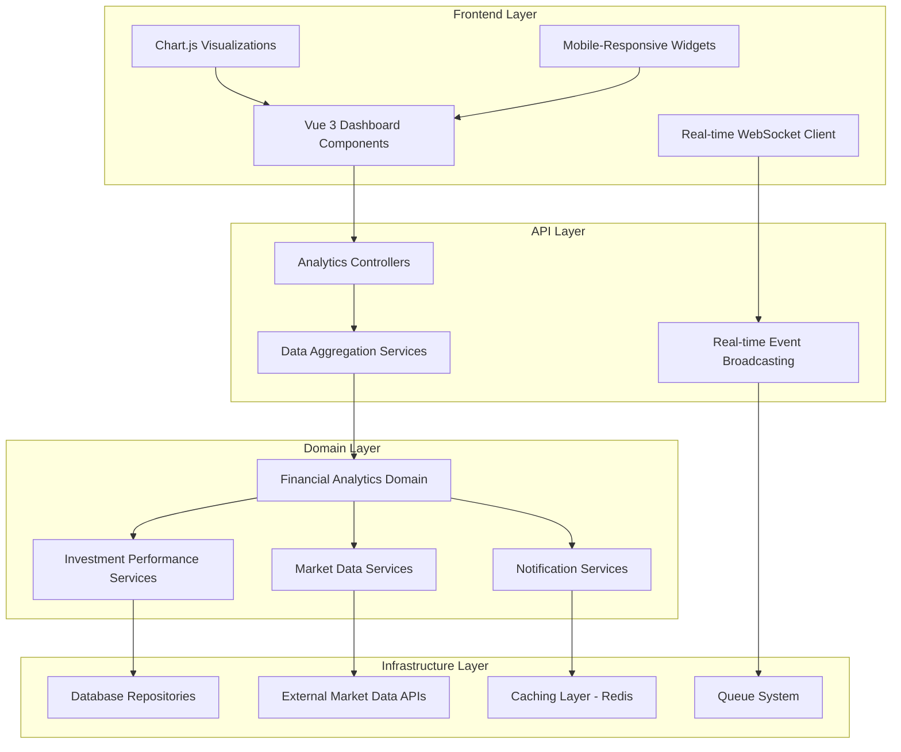

# Design Document

## Overview

The Real-Time Financial Analytics Dashboard is a comprehensive financial visualization system that provides VBIF members with live insights into their investment performance, fund metrics, and market trends. The system leverages the existing Vue 3 + TypeScript frontend architecture with Chart.js integration, Laravel backend with domain-driven design, and real-time data updates to deliver an engaging and informative user experience.

The dashboard will be built as a modular system of Vue components that can be embedded in the existing member dashboard, with dedicated API endpoints for real-time data fetching and WebSocket connections for live updates.

## Architecture

### High-Level Architecture



### Data Flow Architecture

1. **Real-time Updates**: WebSocket connections push live data to frontend components
2. **API Endpoints**: RESTful endpoints serve initial data and handle user interactions
3. **Background Processing**: Queue jobs calculate complex analytics and update cached data
4. **Caching Strategy**: Redis caches frequently accessed metrics and calculations
5. **Event Broadcasting**: Laravel Echo broadcasts real-time updates to connected clients

## Components and Interfaces

### Frontend Components

#### 1. FinancialAnalyticsDashboard.vue
**Purpose**: Main container component that orchestrates all analytics widgets
**Props**: 
- `userId: number` - Current user identifier
- `refreshInterval: number` - Update frequency in seconds
- `layout: 'desktop' | 'mobile'` - Responsive layout mode

**Key Methods**:
- `initializeWebSocket()` - Establishes real-time connection
- `refreshAllWidgets()` - Triggers data refresh across all widgets
- `handleLayoutChange()` - Adapts to screen size changes

#### 2. InvestmentPerformanceWidget.vue
**Purpose**: Displays individual investment performance metrics
**Props**:
- `investments: UserInvestment[]` - User's investment portfolio
- `showComparison: boolean` - Enable tier comparison view

**Features**:
- Color-coded performance indicators
- Tier-based breakdown
- Percentage change calculations
- Interactive hover details

#### 3. FundPerformanceChart.vue
**Purpose**: Interactive Chart.js visualization of fund performance
**Props**:
- `timeRange: '1M' | '3M' | '6M' | '1Y' | 'ALL'` - Chart time period
- `chartType: 'line' | 'area' | 'candlestick'` - Visualization type

**Chart Features**:
- Zoom and pan capabilities
- Responsive design
- Real-time data updates
- Custom tooltips with fund metrics

#### 4. GrowthTrackingChart.vue
**Purpose**: Time-series visualization of individual investment growth
**Props**:
- `userId: number` - User identifier
- `showDistributions: boolean` - Mark profit distribution events

**Interactive Features**:
- Time period filtering
- Event markers for distributions and investments
- CAGR calculation display
- Export functionality

#### 5. ProfitForecastWidget.vue
**Purpose**: Displays projected profit distributions and scenarios
**Props**:
- `forecastPeriod: number` - Months to forecast
- `showConfidenceIntervals: boolean` - Display uncertainty ranges

**Forecast Features**:
- Conservative and optimistic scenarios
- Confidence interval visualization
- Historical accuracy tracking
- Disclaimer and educational content

#### 6. MarketTrendsChart.vue
**Purpose**: Market analysis with correlation to fund performance
**Props**:
- `marketIndicators: string[]` - Selected market indicators
- `showCorrelation: boolean` - Display fund correlation

**Market Features**:
- Multiple indicator support
- Educational tooltips
- Correlation analysis
- External data integration

#### 7. MobileFinancialWidget.vue
**Purpose**: Touch-optimized mobile widget for key metrics
**Props**:
- `widgetType: 'performance' | 'growth' | 'forecast'` - Widget focus
- `compactMode: boolean` - Ultra-compact display

**Mobile Features**:
- Swipe navigation
- Touch-friendly interactions
- Optimized data loading
- Offline capability

### Backend Components

#### 1. Financial Analytics Domain

**FinancialAnalyticsService**
```php
class FinancialAnalyticsService
{
    public function calculateUserPerformance(UserId $userId): UserPerformanceMetrics;
    public function getFundPerformanceMetrics(DateRange $range): FundPerformanceData;
    public function generateProfitForecast(UserId $userId, int $months): ProfitForecast;
    public function getMarketCorrelationData(DateRange $range): MarketCorrelationData;
}
```

**InvestmentPerformanceCalculator**
```php
class InvestmentPerformanceCalculator
{
    public function calculateROI(UserInvestment $investment): ROIMetrics;
    public function calculateCAGR(UserInvestment $investment): float;
    public function calculateTierComparison(UserId $userId): TierComparisonData;
}
```

#### 2. API Controllers

**AnalyticsController**
```php
class AnalyticsController extends Controller
{
    public function getUserPerformance(Request $request): JsonResponse;
    public function getFundMetrics(Request $request): JsonResponse;
    public function getGrowthData(Request $request): JsonResponse;
    public function getProfitForecast(Request $request): JsonResponse;
    public function getMarketTrends(Request $request): JsonResponse;
}
```

**RealTimeAnalyticsController**
```php
class RealTimeAnalyticsController extends Controller
{
    public function subscribe(Request $request): JsonResponse;
    public function unsubscribe(Request $request): JsonResponse;
    public function getLatestMetrics(Request $request): JsonResponse;
}
```

#### 3. WebSocket Event Broadcasting

**PerformanceUpdateEvent**
```php
class PerformanceUpdateEvent implements ShouldBroadcast
{
    public function __construct(
        public UserId $userId,
        public PerformanceMetrics $metrics,
        public DateTime $timestamp
    ) {}
    
    public function broadcastOn(): array
    {
        return [new PrivateChannel("user.{$this->userId->value()}.analytics")];
    }
}
```

## Data Models

### Value Objects

#### PerformanceMetrics
```php
class PerformanceMetrics
{
    public function __construct(
        public readonly InvestmentAmount $currentValue,
        public readonly InvestmentAmount $initialValue,
        public readonly float $percentageChange,
        public readonly float $absoluteChange,
        public readonly DateTime $lastUpdated
    ) {}
    
    public function isPositive(): bool;
    public function getColorCode(): string;
    public function formatForDisplay(): array;
}
```

#### FundPerformanceData
```php
class FundPerformanceData
{
    public function __construct(
        public readonly InvestmentAmount $totalFundValue,
        public readonly int $activeMemberCount,
        public readonly float $averageReturn,
        public readonly float $yearToDateReturn,
        public readonly array $quarterlyTrends
    ) {}
}
```

#### ProfitForecast
```php
class ProfitForecast
{
    public function __construct(
        public readonly array $conservativeScenario,
        public readonly array $optimisticScenario,
        public readonly array $confidenceIntervals,
        public readonly DateTime $generatedAt,
        public readonly int $forecastMonths
    ) {}
}
```

### Database Schema Extensions

#### analytics_cache Table
```sql
CREATE TABLE analytics_cache (
    id BIGINT PRIMARY KEY AUTO_INCREMENT,
    cache_key VARCHAR(255) NOT NULL UNIQUE,
    data JSON NOT NULL,
    expires_at TIMESTAMP NOT NULL,
    created_at TIMESTAMP DEFAULT CURRENT_TIMESTAMP,
    updated_at TIMESTAMP DEFAULT CURRENT_TIMESTAMP ON UPDATE CURRENT_TIMESTAMP,
    INDEX idx_cache_key (cache_key),
    INDEX idx_expires_at (expires_at)
);
```

#### performance_snapshots Table
```sql
CREATE TABLE performance_snapshots (
    id BIGINT PRIMARY KEY AUTO_INCREMENT,
    user_id BIGINT NOT NULL,
    investment_value DECIMAL(15,2) NOT NULL,
    percentage_change DECIMAL(8,4) NOT NULL,
    snapshot_date DATE NOT NULL,
    created_at TIMESTAMP DEFAULT CURRENT_TIMESTAMP,
    FOREIGN KEY (user_id) REFERENCES users(id),
    UNIQUE KEY unique_user_date (user_id, snapshot_date),
    INDEX idx_user_date (user_id, snapshot_date)
);
```

#### market_data Table
```sql
CREATE TABLE market_data (
    id BIGINT PRIMARY KEY AUTO_INCREMENT,
    indicator_name VARCHAR(100) NOT NULL,
    indicator_value DECIMAL(15,6) NOT NULL,
    data_date DATE NOT NULL,
    source VARCHAR(100) NOT NULL,
    created_at TIMESTAMP DEFAULT CURRENT_TIMESTAMP,
    UNIQUE KEY unique_indicator_date (indicator_name, data_date),
    INDEX idx_date (data_date)
);
```

## Error Handling

### Frontend Error Handling

#### Connection Management
- **WebSocket Disconnection**: Automatic reconnection with exponential backoff
- **API Timeout**: Graceful degradation with cached data display
- **Chart Rendering Errors**: Fallback to simplified visualizations
- **Mobile Network Issues**: Offline mode with last known data

#### User Experience
- **Loading States**: Skeleton screens and progress indicators
- **Error Messages**: User-friendly error descriptions with retry options
- **Data Validation**: Client-side validation with server confirmation
- **Performance Degradation**: Automatic quality reduction on slow connections

### Backend Error Handling

#### Data Processing Errors
```php
class AnalyticsErrorHandler
{
    public function handleCalculationError(CalculationException $e): ErrorResponse;
    public function handleDataSourceError(DataSourceException $e): ErrorResponse;
    public function handleCacheError(CacheException $e): ErrorResponse;
}
```

#### API Error Responses
- **400 Bad Request**: Invalid parameters with specific field errors
- **401 Unauthorized**: Authentication required with redirect
- **403 Forbidden**: Insufficient permissions with explanation
- **429 Too Many Requests**: Rate limiting with retry-after header
- **500 Internal Server Error**: Generic error with tracking ID

#### Background Job Error Handling
- **Queue Failures**: Automatic retry with exponential backoff
- **External API Failures**: Circuit breaker pattern implementation
- **Database Errors**: Transaction rollback with error logging
- **Memory Limits**: Batch processing with progress tracking

## Testing Strategy

### Frontend Testing

#### Unit Tests (Vitest)
- **Component Logic**: Test Vue component methods and computed properties
- **Data Transformations**: Test chart data formatting and calculations
- **WebSocket Handling**: Mock WebSocket connections and message handling
- **Mobile Responsiveness**: Test responsive behavior and touch interactions

#### Integration Tests
- **API Integration**: Test component interaction with backend APIs
- **Chart Rendering**: Test Chart.js integration and data visualization
- **Real-time Updates**: Test WebSocket event handling and UI updates
- **Cross-browser Compatibility**: Test on different browsers and devices

### Backend Testing

#### Unit Tests (Pest PHP)
- **Domain Services**: Test business logic and calculations
- **Value Objects**: Test immutability and validation rules
- **Performance Calculations**: Test ROI, CAGR, and forecast algorithms
- **Error Handling**: Test exception scenarios and error responses

#### Integration Tests
- **API Endpoints**: Test complete request/response cycles
- **Database Operations**: Test repository implementations and queries
- **WebSocket Broadcasting**: Test real-time event broadcasting
- **External API Integration**: Test market data fetching and processing

#### Performance Tests
- **Load Testing**: Test system performance under concurrent users
- **Database Query Optimization**: Test query performance and indexing
- **Caching Effectiveness**: Test cache hit rates and performance gains
- **Memory Usage**: Test memory consumption during data processing

### End-to-End Testing

#### User Workflows
- **Dashboard Loading**: Test complete dashboard initialization
- **Real-time Updates**: Test live data updates across multiple clients
- **Mobile Experience**: Test touch interactions and responsive design
- **Notification Delivery**: Test alert generation and delivery

#### Performance Monitoring
- **Page Load Times**: Monitor dashboard loading performance
- **API Response Times**: Track API endpoint performance
- **WebSocket Latency**: Monitor real-time update delays
- **Mobile Performance**: Test performance on various mobile devices

## Security Considerations

### Data Protection
- **User Data Isolation**: Ensure users only access their own financial data
- **API Authentication**: JWT tokens with proper expiration and refresh
- **WebSocket Security**: Authenticated channels with user verification
- **Data Encryption**: Encrypt sensitive financial data in transit and at rest

### Rate Limiting
- **API Endpoints**: Implement rate limiting to prevent abuse
- **WebSocket Connections**: Limit concurrent connections per user
- **Data Export**: Throttle data export functionality
- **Notification Frequency**: Prevent notification spam

### Input Validation
- **Parameter Sanitization**: Validate all user inputs and API parameters
- **SQL Injection Prevention**: Use parameterized queries and ORM
- **XSS Protection**: Sanitize data before rendering in components
- **CSRF Protection**: Implement CSRF tokens for state-changing operations

## Performance Optimization

### Frontend Optimization
- **Code Splitting**: Lazy load analytics components
- **Data Virtualization**: Efficiently render large datasets
- **Image Optimization**: Optimize chart rendering and caching
- **Bundle Size**: Minimize JavaScript bundle size

### Backend Optimization
- **Database Indexing**: Optimize queries with proper indexes
- **Caching Strategy**: Implement multi-layer caching (Redis, application, browser)
- **Query Optimization**: Use efficient database queries and aggregations
- **Background Processing**: Move heavy calculations to queue jobs

### Real-time Performance
- **WebSocket Optimization**: Efficient message broadcasting and filtering
- **Data Compression**: Compress real-time data payloads
- **Connection Pooling**: Optimize database connection usage
- **Memory Management**: Efficient memory usage in long-running processes