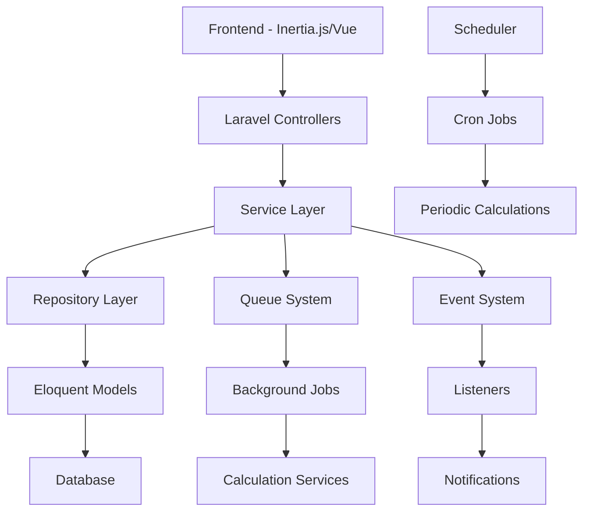

# Design Document

## Overview

The VBIF Reward System design leverages the existing Laravel application structure with Inertia.js frontend, extending current models and services to implement a comprehensive investment management platform. The system will utilize Laravel's queue system for background processing of calculations, implement robust financial transaction handling, and provide real-time dashboard updates through optimized database queries and caching strategies.

## Architecture

### High-Level Architecture



### Service-Oriented Design

The system follows a service-oriented architecture with clear separation of concerns:

- **Controllers**: Handle HTTP requests and responses
- **Services**: Business logic and complex operations
- **Repositories**: Data access abstraction
- **Jobs**: Background processing for heavy calculations
- **Events/Listeners**: Decoupled system notifications
- **Commands**: Scheduled tasks for periodic operations

## Components and Interfaces

### Core Services

#### 1. InvestmentTierService
```php
interface InvestmentTierServiceInterface
{
    public function calculateTierForAmount(float $amount): InvestmentTier;
    public function upgradeTierIfEligible(User $user): bool;
    public function getTierBenefits(InvestmentTier $tier): array;
    public function calculateProfitShare(User $user, float $totalProfit): float;
}
```

#### 2. ReferralMatrixService
```php
interface ReferralMatrixServiceInterface
{
    public function buildMatrix(User $user): array;
    public function findNextAvailablePosition(User $sponsor): ?array;
    public function processSpillover(User $newUser, User $sponsor): void;
    public function calculateMatrixCommissions(Investment $investment): array;
}
```

#### 3. ProfitDistributionService
```php
interface ProfitDistributionServiceInterface
{
    public function distributeAnnualProfits(float $totalProfit): void;
    public function distributeQuarterlyBonuses(float $bonusPool): void;
    public function calculateInvestorShare(User $user, float $totalPool): float;
}
```

#### 4. WithdrawalPolicyService
```php
interface WithdrawalPolicyServiceInterface
{
    public function validateWithdrawal(User $user, float $amount): array;
    public function calculatePenalties(Investment $investment): array;
    public function processClawback(User $user, float $amount): void;
    public function canWithdraw(User $user): bool;
}
```

### Repository Pattern Implementation

#### 1. InvestmentRepository
```php
interface InvestmentRepositoryInterface
{
    public function findActiveInvestmentsByUser(User $user): Collection;
    public function getTotalInvestmentPool(): float;
    public function getInvestmentsByDateRange(Carbon $start, Carbon $end): Collection;
    public function calculateUserPoolPercentage(User $user): float;
}
```

#### 2. ReferralRepository
```php
interface ReferralRepositoryInterface
{
    public function getReferralTree(User $user, int $maxLevel = 3): array;
    public function getDirectReferrals(User $user): Collection;
    public function getReferralsByLevel(User $user, int $level): Collection;
    public function buildMatrixStructure(User $user): array;
}
```

## Data Models

### Enhanced Models Structure

#### 1. User Model Extensions
```php
// Additional fields to be added via migration
- matrix_position: json (stores 3x3 matrix position data)
- total_investment_amount: decimal(15,2)
- total_referral_earnings: decimal(15,2)
- total_profit_earnings: decimal(15,2)
- referral_code: string(unique)
- referral_count: integer
- last_referral_at: timestamp
- tier_upgraded_at: timestamp
- tier_history: json
```

#### 2. New Models to Create

##### MatrixPosition Model
```php
class MatrixPosition extends Model
{
    protected $fillable = [
        'user_id',
        'sponsor_id',
        'level',
        'position',
        'left_child_id',
        'middle_child_id',
        'right_child_id',
        'is_active'
    ];
}
```

##### ProfitDistribution Model
```php
class ProfitDistribution extends Model
{
    protected $fillable = [
        'period_type', // 'annual' or 'quarterly'
        'period_start',
        'period_end',
        'total_profit',
        'distribution_percentage',
        'total_distributed',
        'status'
    ];
}
```

##### WithdrawalRequest Model
```php
class WithdrawalRequest extends Model
{
    protected $fillable = [
        'user_id',
        'investment_id',
        'amount',
        'type', // 'full', 'partial', 'emergency'
        'status',
        'penalty_amount',
        'net_amount',
        'requested_at',
        'approved_at',
        'processed_at',
        'admin_notes'
    ];
}
```

##### CommissionClawback Model
```php
class CommissionClawback extends Model
{
    protected $fillable = [
        'referral_commission_id',
        'user_id',
        'original_amount',
        'clawback_amount',
        'reason',
        'processed_at'
    ];
}
```

### Database Schema Enhancements

#### Investment Tiers Configuration
```sql
-- Update investment_tiers table with VBIF specific rates
UPDATE investment_tiers SET
    fixed_profit_rate = CASE name
        WHEN 'Basic' THEN 3.00
        WHEN 'Starter' THEN 5.00
        WHEN 'Builder' THEN 7.00
        WHEN 'Leader' THEN 10.00
        WHEN 'Elite' THEN 15.00
    END,
    direct_referral_rate = CASE name
        WHEN 'Basic' THEN 5.00
        WHEN 'Starter' THEN 7.00
        WHEN 'Builder' THEN 10.00
        WHEN 'Leader' THEN 12.00
        WHEN 'Elite' THEN 15.00
    END;
```

## Error Handling

### Exception Hierarchy
```php
abstract class VBIFException extends Exception {}

class InsufficientFundsException extends VBIFException {}
class InvalidTierException extends VBIFException {}
class WithdrawalNotAllowedException extends VBIFException {}
class MatrixPositionException extends VBIFException {}
class CommissionCalculationException extends VBIFException {}
```

### Error Response Structure
```php
class ErrorResponse
{
    public function __construct(
        public string $code,
        public string $message,
        public array $details = [],
        public int $httpStatus = 400
    ) {}
}
```

### Validation Rules
```php
class InvestmentValidationRules
{
    public static function create(): array
    {
        return [
            'amount' => 'required|numeric|min:500',
            'tier_id' => 'required|exists:investment_tiers,id',
            'referrer_code' => 'nullable|exists:users,referral_code'
        ];
    }
    
    public static function withdrawal(): array
    {
        return [
            'amount' => 'required|numeric|min:1',
            'type' => 'required|in:full,partial,emergency',
            'reason' => 'required_if:type,emergency|string|max:500'
        ];
    }
}
```

## Testing Strategy

### Unit Testing Approach

#### 1. Service Layer Tests
```php
class InvestmentTierServiceTest extends TestCase
{
    public function test_calculates_correct_tier_for_amount()
    public function test_upgrades_tier_when_eligible()
    public function test_calculates_accurate_profit_share()
}

class ReferralMatrixServiceTest extends TestCase
{
    public function test_builds_correct_matrix_structure()
    public function test_handles_spillover_correctly()
    public function test_calculates_matrix_commissions()
}
```

#### 2. Model Tests
```php
class UserTest extends TestCase
{
    public function test_calculates_total_earnings()
    public function test_generates_unique_referral_code()
    public function test_builds_referral_tree()
}

class InvestmentTest extends TestCase
{
    public function test_determines_correct_tier()
    public function test_calculates_current_value()
    public function test_validates_lock_in_period()
}
```

#### 3. Integration Tests
```php
class InvestmentFlowTest extends TestCase
{
    public function test_complete_investment_process()
    public function test_referral_commission_distribution()
    public function test_profit_share_calculation()
    public function test_withdrawal_with_penalties()
}
```

### Performance Testing

#### Database Query Optimization
- Index optimization for referral tree queries
- Caching strategies for matrix calculations
- Pagination for large datasets
- Query result caching for dashboard metrics

#### Load Testing Scenarios
- Concurrent investment processing
- Bulk profit distribution
- Matrix calculation under load
- Real-time dashboard updates

### Security Testing

#### Financial Security
- Transaction integrity validation
- Double-spending prevention
- Audit trail verification
- Calculation accuracy verification

#### Access Control Testing
- Role-based permission validation
- Investment tier access control
- Withdrawal authorization testing
- Admin function security

## Implementation Phases

### Phase 1: Core Infrastructure
1. Database migrations for new models
2. Enhanced existing models with new fields
3. Repository pattern implementation
4. Basic service layer structure

### Phase 2: Investment Management
1. Investment tier service implementation
2. Profit calculation services
3. Investment validation and processing
4. Basic dashboard functionality

### Phase 3: Referral System
1. Matrix position management
2. Referral commission calculation
3. Spillover logic implementation
4. Referral tree visualization

### Phase 4: Advanced Features
1. Withdrawal policy enforcement
2. Commission clawback system
3. Performance-based bonuses
4. Real-time notifications

### Phase 5: Optimization & Security
1. Performance optimization
2. Security hardening
3. Comprehensive testing
4. Documentation and deployment

## Technology Stack Integration

### Laravel Features Utilized
- **Eloquent ORM**: For complex relationship management
- **Queue System**: For background calculations
- **Event System**: For decoupled notifications
- **Validation**: For input sanitization
- **Middleware**: For authentication and authorization
- **Artisan Commands**: For scheduled tasks

### Frontend Integration (Inertia.js)
- **Real-time Updates**: Using Laravel Echo/Pusher
- **Interactive Dashboards**: Vue.js components
- **Form Handling**: Inertia form helpers
- **State Management**: Pinia for complex state

### External Services
- **SMS/Email OTP**: Integration with services like Twilio/SendGrid
- **Payment Processing**: Integration with payment gateways
- **Audit Logging**: Comprehensive activity tracking
- **Backup Systems**: Automated database backups